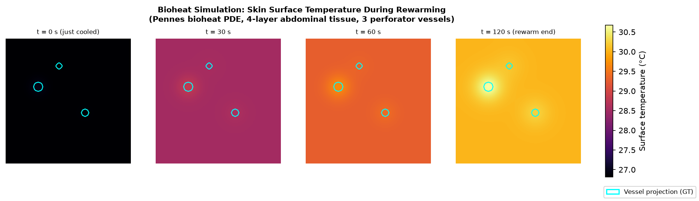

# DIEP-ThermoSim

**Physics-informed synthetic data and deep learning for automated perforator detection in Dynamic Infrared Thermography (DIRT).**

A reproducible pipeline coupling a 3D Pennes bioheat finite-difference solver with a spatio-temporal U-Net to detect perforators from cooling–rewarming thermal video, with calibrated uncertainty estimation via MC Dropout.

[](https://www.python.org/)
[](https://pytorch.org/)
[](https://opensource.org/licenses/MIT)

---

## Overview

Dynamic Infrared Thermography (DIRT) is a non-invasive, radiation-free alternative to CT angiography for **perforator mapping in DIEP-flap breast reconstruction surgery**. Perforators are small blood vessels that must be identified and evaluated before surgery; their location and quality determine flap viability. Recent work has shown that deep learning can automate perforator detection from DIRT video, but two challenges remain:

1. **Data scarcity.** Annotated clinical DIRT datasets are small, limiting the training of data-hungry models.
2. **Absence of subsurface ground truth.** Surface thermography reveals projections of subsurface vessels, but the relationship between vessel geometry (depth, radius, perfusion rate) and the resulting surface thermal signature is governed by tissue physics that is not directly observable.

This repository addresses both by generating **physics-grounded synthetic DIRT sequences** via a finite-difference Pennes bioheat solver, pairing each simulation with full ground-truth labels for vessel location and clinical-proxy quality. The synthetic engine can function as a standalone training environment or as a data-augmentation step alongside small clinical cohorts.

---

## Simulation

The figure below shows skin surface temperature during a simulated DIRT protocol: 60 s of cold-pack cooling followed by 120 s of natural rewarming. Three perforator vessels (cyan contours) of decreasing quality rewarm faster than the surrounding tissue, producing the localized hotspots that clinical DIRT-based detection relies on.

<p align="center">
  
</p>

---

## Methodological background

This project extends the hybrid **explicit forward model + learned residual** paradigm from prior published work on dynamic 3D scene reconstruction (DynGS-Pro, KSEM 2026), transposed from the visual to the thermal domain.

| Component | DynGS-Pro (visual reconstruction) | DIEP-ThermoSim (thermal reconstruction) |
|---|---|---|
| Explicit forward model | Gaussian primitive representation | Pennes bioheat PDE on a 3D voxel grid |
| Learned residual | Deformation field MLP over (x, y, z, t) | Thermal deformation field MLP over (x, y, t) |
| Inverse problem | Recover 3D scene structure from 2D image views | Recover subsurface vessel geometry from 2D surface thermography |
| Temporal dynamics | Non-rigid scene motion | Skin surface temperature evolution during rewarming |

The `deformation_field.py` module is a direct port of the thesis architecture: a small MLP on Fourier-encoded spatio-temporal coordinates with a mid-layer skip connection. In the original work it predicted 3D Gaussian displacements; here it predicts per-pixel thermal residuals correcting the bulk PDE for patient-specific effects (skin texture, perspiration, non-uniform cooling, fine-scale perfusion heterogeneity).

---

## Method

```
            ┌─────────────────────┐    ┌────────────────────────┐
random      │  Pennes bioheat     │    │  PerforatorNet         │
vessel  ──► │  3D FDM solver      │──► │  3D conv encoder +     │ ──► mask + quality
config      │  (cool → rewarm)    │    │  2D U-Net decoder      │
            └─────────────────────┘    └────────────────────────┘
                       │
               thermal video               ground-truth from
               [T, H, W]                   simulated geometry
```

### Physics

The Pennes bioheat equation governs heat transfer in perfused tissue:

```
ρ · c · ∂T/∂t = ∇·(k ∇T) + ρ_b · w_b · c_b · (T_a − T) + Q_m
```

where ρ, c, k are tissue density, specific heat, and thermal conductivity; w_b is blood perfusion rate; ρ_b · c_b is the blood heat-capacity product; T_a is arterial blood temperature; and Q_m is metabolic heat generation.

Perforators are modelled as cylindrical regions of elevated w_b rising from the muscle through the fat layer. The domain uses a 4-layer abdominal skin model (epidermis, dermis, fat, muscle) with properties from the ITIS Foundation tissue database. A Robin boundary condition at the skin surface implements the cooling-rewarming protocol: controlled cooling via cold pack contact, followed by natural rewarming with gentle convective exchange at ambient temperature.

### Learning task

Each simulation produces a thermal video [T frames, H, W] of skin-surface temperature during rewarming, a soft ground-truth vessel projection mask [H, W], and a per-pixel quality map [H, W] proxying clinical perforator strength. **PerforatorNet** (3D conv temporal encoder collapsing the time dimension, 2D U-Net decoder, dual output heads) is trained with BCE + Dice loss on the mask and quality-weighted MSE on the quality map. MC Dropout at inference produces per-pixel uncertainty estimates aligned with ambiguous low-signal regions.

---

## Project structure

```
DIEP-ThermoSim/
├── README.md
├── LICENSE                       # MIT
├── requirements.txt
├── .gitignore
├── bioheat.py                    # Pennes 3D finite-difference solver
├── deformation_field.py          # thermal residual MLP (port of DynGS-Pro architecture)
├── dataset.py                    # synthetic dataset generation + PyTorch Dataset
├── model.py                      # PerforatorNet architecture + compound loss
├── train.py                      # training loop, MC Dropout inference, localization metric
├── visualize.py                  # figure generation (solver demo, teaser, training curve, GIF)
├── diagnose.py                   # checkpoint evaluation utility
├── configs/
│   └── default.yaml
└── docs/
    ├── figures/
    │   └── solver_demo.png
    ├── RUN_GUIDE.md
    ├── GITHUB_UPLOAD_GUIDE.md
    └── POSITIONING_STRATEGY.md
```

---

## Quick start

```bash
# Install dependencies
pip install torch torchvision --index-url https://download.pytorch.org/whl/cu121
pip install -r requirements.txt
pip install matplotlib imageio imageio-ffmpeg

# Verify GPU
python3 -c "import torch; print(torch.cuda.is_available(), torch.cuda.get_device_name(0))"

# Smoke tests (no data download needed)
python3 bioheat.py
python3 model.py
python3 train.py --smoke-test

# Generate synthetic dataset
python3 dataset.py --generate --out data/train --n-samples 200 --seed 0
python3 dataset.py --generate --out data/val   --n-samples 40  --seed 1

# Train
python3 train.py \
    --train-dir data/train \
    --val-dir   data/val   \
    --epochs 30 --batch-size 2 --n-frames 16 \
    --out-dir runs/exp1

# Generate figures
python3 visualize.py --checkpoint runs/exp1/best.pt --data-dir data/val
```

---

## Results

### Perforator localization on synthetic validation set (N=40)

Metric: nearest-neighbour peak matching, 5 px tolerance (5 mm at 1 mm/voxel resolution).

| Model | F1 | Precision | Recall |
|---|---|---|---|
| PerforatorNet + thermal deformation field | 0.863 | 0.988 | 0.787 |
| PerforatorNet baseline (no deformation field) | **0.878** | **1.000** | **0.810** |

On 200 synthetic training samples, the deformation field does not improve over the baseline. The Pennes forward model explains the controlled synthetic domain well, leaving little systematic residual for the network to correct. The deformation field is expected to become beneficial on real clinical data, where tissue heterogeneity, patient-specific anatomy, and measurement noise introduce deviations the PDE cannot capture. Quantifying this gap on a clinical cohort is the primary open question motivating the project.

---

## Limitations

- **Simplified tissue model.** Real abdominal tissue has spatially varying material properties, anisotropic perfusion, and surface curvature; the current 4-layer homogeneous model approximates these.
- **Synthetic-to-real gap not yet quantified.** The repository establishes the simulation and training infrastructure. Measuring domain shift on a clinical cohort requires institutional data access and is treated as future work.
- **Perforation configuration range.** The data generator samples 2-6 perforators per field; configurations outside this range require re-tuning the rejection-sampling parameters in `dataset.py`.
- **Quality label is a geometric proxy.** The quality map (perfusion × radius × inverse depth) is not a validated clinical outcome measure; it is a learnable feature standing in for expert grading.

---

## Roadmap

1. Replace forward Euler time integration with implicit Crank-Nicolson for larger stable time steps and faster dataset generation.
2. Add surface curvature: simulate over a curved abdominal patch with non-vertical perforator trajectories.
3. Domain-randomization study: vary tissue properties, cooling protocol severity, and camera noise; measure where detection breaks down.
4. Compare MC Dropout vs Deep Ensembles for uncertainty calibration on this task.
5. Integration test against a publicly released clinical DIRT sequence.

---

## Related work

- Clarys, W. et al. (2025). *Optimising neural networks for perforator detection in DIEP flap breast reconstruction using dynamic infrared thermography.* Quantitative InfraRed Thermography Journal.
- Cardenas De La Hoz, E. et al. (2024). *Automated thermographic detection of blood vessels for DIEP flap reconstructive surgery.* International Journal of Computer Assisted Radiology and Surgery.
- Clarys, W. et al. (2025). *Comparative study of cooling techniques for perforator detection in DIEP flap reconstruction using dynamic infrared thermography.*
- Thiessen, F. E. F. et al. (2020). *DIRT in DIEP flap breast reconstruction: A clinical study with a standardized measurement setup.*
- Pennes, H. H. (1948). *Analysis of tissue and arterial blood temperatures in the resting human forearm.* Journal of Applied Physiology.

---

## Citation

```bibtex
@misc{asghar2026diepthermosim,
  author = {Asghar, Iqra},
  title  = {DIEP-ThermoSim: Physics-Informed Synthetic Data for Perforator Detection
            in Dynamic Infrared Thermography},
  year   = {2026},
  url    = {https://github.com/IQRAASGHAR1999/DIEP-ThermoSim}
}
```

---

## License

MIT. See `LICENSE`.
